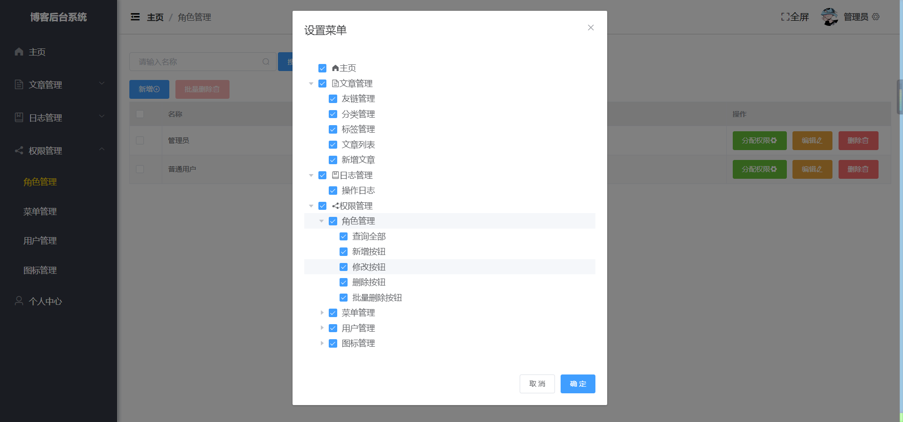
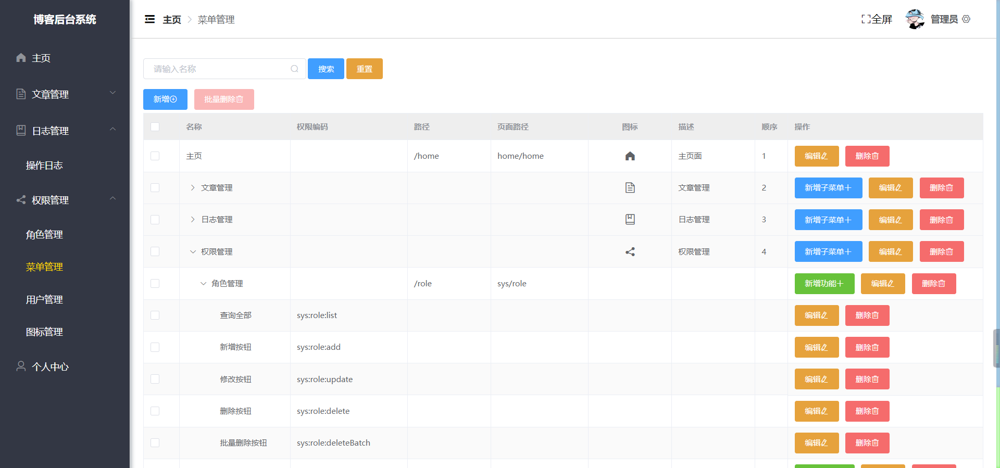

#### 介绍
基于SpringBoot + Vue开发的前后端分离博客，采用SpringSecurity进行动态权限管理，ElasticSearch全文搜索

#### 软件架构
B/S架构，采用前后端分离技术

#### 安装教程

1、Java 项目一键启动

2、前端项目先下载依赖 npm install

3、博客前台启动 npm run dev

4、博客后台启动 npm run serve

5、将sql下的两个sql文件分别导入mysql和mongoDB中

#### 技术介绍

前端技术:Vue2 + Vuex + Vue - Router + Axios + Element - ui + Bootstrap + Echarts + JavaScript

后端技术:SpringBoot + Jwt + MyBatisPlus + MySQL+ Redis + Swagger + Druid + SpringSecurity + ElasticSearch + WebSocket + RabbitMQ + OSS + MongonDB

* 采用Markdown编辑器，写法简单

* 使用SpringSecurity + Jwt实现RBAC权限模型，可进行动态分配权限

* 接入百度API，实现过滤不文明评论文字和博客图片

* OSS图片存储在阿里云

* 使用AOP切入进行增加、修改、删除、批量删除日志记录

* 实现了在线聊天功能

* 评论数据存储在MogonDB数据库中

* Redis和SpringCache进行整合，提高数据访问效率

* 使用定时任务进行对Redis中的缓存数据进行删除

* 使用搜索引擎ElasticSearch进行全文检索

* 使用RabbitMQ保证MySQL数据库和ElasticSearch搜索引擎的数据同步

* 使用异步线程池进行对浏览量更新操作

* ES中数据展示

#### 前台效果

* 前台博客主页面

* 文章详情页面

* 标签页面

* 友链页面

* 评论页面

* 输入敏感词评论效果

#### 后台效果

* 登录页面

  
* 首页

* 友链管理

* 分类管理

* 标签管理

* 新增文章

* 文章列表

* 日志管理

* 角色管理

* 分配权限

* 菜单管理

* 用户管理

#### 可加QQ询问
QQ：2740860037
